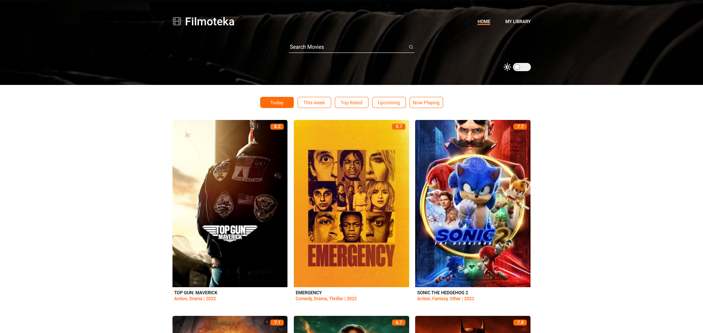
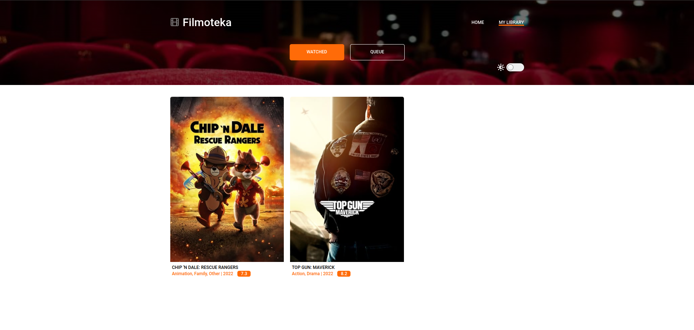
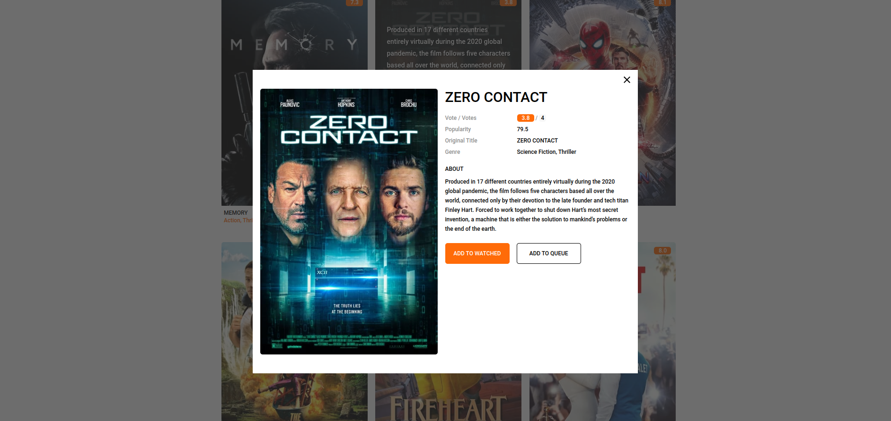
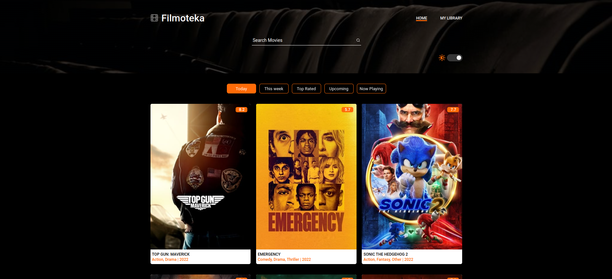
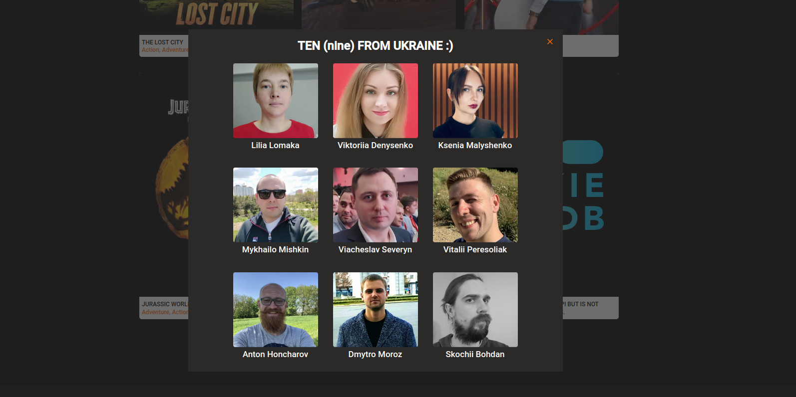

# Team project that concludes a Javascript module at GoIT Full Stack Web Dev course

9 people had gathered to create a fully fledged professional website with HTML, SCSS and vanilla
Javascript.

Adaptive layout. Parcel bundler, teamwork, extensive Git practice. AJAX, working with API's,
Javascript, external libraries for gallery images and a slider.

My role here was a Team Lead. Daily discussions, planning, code review of the github commits,
fixing/finding errors, organizing files for the team.

